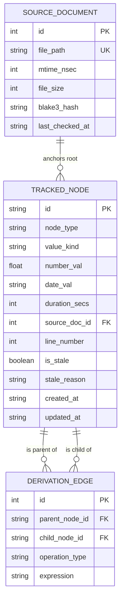

# Data Model & Storage Schema: Provenance Tracking

**Feature Branch**: `001-provenance-tracking` | **Date**: 2026-07-31

## Overview

This document specifies the relational SQLite database schema (`.rgt/store.db`) and Rust data structures representing the provenance DAG for numeric and date values.

---

## Entity-Relationship Diagram



---

## SQLite Database Schema (`.rgt/store.db`)

```sql
PRAGMA journal_mode = WAL;
PRAGMA foreign_keys = ON;

-- 1. Source Documents Table
CREATE TABLE IF NOT EXISTS source_documents (
    id INTEGER PRIMARY KEY AUTOINCREMENT,
    file_path TEXT NOT NULL UNIQUE,
    mtime_nsec INTEGER NOT NULL,
    file_size INTEGER NOT NULL,
    blake3_hash TEXT NOT NULL,
    last_checked_at TEXT NOT NULL
);

CREATE INDEX IF NOT EXISTS idx_source_documents_path 
ON source_documents(file_path);

-- 2. Tracked Nodes Table
CREATE TABLE IF NOT EXISTS tracked_nodes (
    id TEXT PRIMARY KEY,                       -- e.g. "node_raw_a1b2c3d4" or "node_drv_e5f6g7h8"
    node_type TEXT NOT NULL CHECK(node_type IN ('ROOT', 'DERIVED')),
    value_kind TEXT NOT NULL CHECK(value_kind IN ('NUMBER', 'DATE', 'DURATION')),
    number_val REAL,
    date_val TEXT,                             -- ISO-8601 string: YYYY-MM-DDTHH:MM:SSZ
    duration_secs INTEGER,
    source_doc_id INTEGER REFERENCES source_documents(id) ON DELETE SET NULL,
    line_number INTEGER,
    is_stale INTEGER NOT NULL DEFAULT 0 CHECK(is_stale IN (0, 1)),
    stale_reason TEXT,                         -- e.g. "SOURCE_FILE_MODIFIED", "PARENT_NODE_STALE", "FILE_DELETED"
    created_at TEXT NOT NULL,
    updated_at TEXT NOT NULL
);

CREATE INDEX IF NOT EXISTS idx_tracked_nodes_source_doc 
ON tracked_nodes(source_doc_id);

CREATE INDEX IF NOT EXISTS idx_tracked_nodes_stale 
ON tracked_nodes(is_stale);

-- 3. Derivation Edges Table
CREATE TABLE IF NOT EXISTS derivation_edges (
    id INTEGER PRIMARY KEY AUTOINCREMENT,
    parent_node_id TEXT NOT NULL REFERENCES tracked_nodes(id) ON DELETE CASCADE,
    child_node_id TEXT NOT NULL REFERENCES tracked_nodes(id) ON DELETE CASCADE,
    operation_type TEXT NOT NULL,              -- e.g. 'ADD', 'SUBTRACT', 'MULTIPLY', 'DIVIDE', 'DATE_DIFF', 'CUSTOM'
    expression TEXT,                           -- Formula or calculation description
    UNIQUE(parent_node_id, child_node_id)
);

CREATE INDEX IF NOT EXISTS idx_derivation_edges_parent 
ON derivation_edges(parent_node_id);

CREATE INDEX IF NOT EXISTS idx_derivation_edges_child 
ON derivation_edges(child_node_id);
```

---

## Rust Struct Definitions

```rust
use chrono::{DateTime, Duration, Utc};
use serde::{Deserialize, Serialize};

#[derive(Debug, Clone, Serialize, Deserialize, PartialEq)]
pub enum ValueKind {
    Number,
    Date,
    Duration,
}

#[derive(Debug, Clone, Serialize, Deserialize, PartialEq)]
pub enum ValueData {
    Number(f64),
    Date(DateTime<Utc>),
    Duration(Duration),
}

#[derive(Debug, Clone, Serialize, Deserialize, PartialEq)]
pub enum NodeType {
    Root,
    Derived,
}

#[derive(Debug, Clone, Serialize, Deserialize)]
pub struct SourceDocument {
    pub id: i64,
    pub file_path: String,
    pub mtime_nsec: i64,
    pub file_size: u64,
    pub blake3_hash: String,
    pub last_checked_at: DateTime<Utc>,
}

#[derive(Debug, Clone, Serialize, Deserialize)]
pub struct TrackedNode {
    pub id: String,
    pub node_type: NodeType,
    pub value: ValueData,
    pub source_doc_id: Option<i64>,
    pub line_number: Option<u32>,
    pub is_stale: bool,
    pub stale_reason: Option<String>,
    pub created_at: DateTime<Utc>,
    pub updated_at: DateTime<Utc>,
}

#[derive(Debug, Clone, Serialize, Deserialize)]
pub struct DerivationEdge {
    pub id: i64,
    pub parent_node_id: String,
    pub child_node_id: String,
    pub operation_type: String,
    pub expression: Option<String>,
}

#[derive(Debug, Clone, Serialize, Deserialize)]
pub struct LineageStep {
    pub node: TrackedNode,
    pub source_doc: Option<SourceDocument>,
    pub operation_from_parents: Option<String>,
    pub parent_ids: Vec<String>,
}

#[derive(Debug, Clone, Serialize, Deserialize)]
pub struct LineageTree {
    pub target_node: TrackedNode,
    pub steps: Vec<LineageStep>,
    pub is_stale: bool,
}
```

---

## State Transition Rules

1. **Root Node Creation**:
   - Status initialized to `is_stale: false`.
   - Linked to `source_documents` record with current `mtime_nsec`, `file_size`, and `blake3_hash`.
2. **Derivation Node Creation**:
   - Status set to `is_stale: true` if ANY parent node is currently `is_stale: true`, else `is_stale: false`.
   - Directed edges added from each parent node to the new derived node.
3. **File Invalidation Cascade**:
   - When a source file is edited, Tier 1 check detects `mtime` or `file_size` change. Tier 2 verifies modified BLAKE3 hash.
   - All root nodes anchored to that `source_doc_id` are flagged `is_stale = 1`, `stale_reason = 'SOURCE_FILE_MODIFIED'`.
   - Invalidation engine executes reverse traversal down `derivation_edges` to set `is_stale = 1` for all downstream dependent nodes in a single SQLite transaction.
