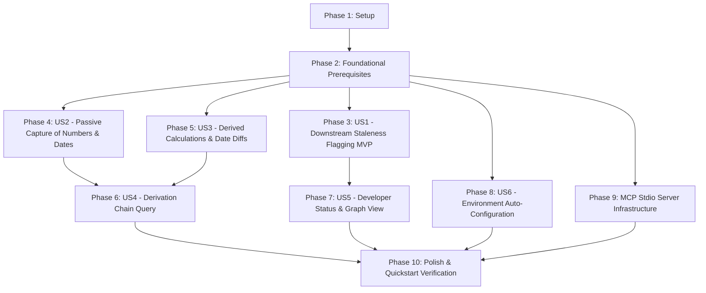

# Tasks: Numeric and Date Provenance Tracking

**Input**: Design documents from `/specs/001-provenance-tracking/`

**Prerequisites**: `plan.md`, `spec.md`, `data-model.md`, `contracts/`, `research.md`, `quickstart.md`

**Organization**: Tasks are grouped by user story to enable independent implementation and testing of each story.

## Task Format: `[ID] [P?] [Story?] Description with file path`

- **[P]**: Parallelizable (different files, no dependencies)
- **[Story]**: User story label (e.g. `[US1]`, `[US2]`, `[US3]`, `[US4]`, `[US5]`, `[US6]`)

---

## Dependency Graph & Story Execution Order



---

## Phase 1: Setup (Shared Infrastructure)

**Purpose**: Cargo workspace initialization and core crate structure.

- [x] T001 Initialize Cargo binary project structure in `Cargo.toml` and `src/main.rs`
- [x] T002 Configure Rust dependencies (`petgraph`, `chrono`, `blake3`, `rusqlite` with `bundled`, `clap`, `tokio`, `serde`, `serde_json`) in `Cargo.toml`
- [x] T003 [P] Setup repository `.gitignore` (ignoring `.rgt/store.db` and `target/`) in `.gitignore`

---

## Phase 2: Foundational (Blocking Prerequisites)

**Purpose**: Database schema, change detection engine, and petgraph DAG wrapper.

**⚠️ CRITICAL**: No user story work can begin until this phase is complete.

- [x] T004 Implement SQLite database schema initialization and connection pool in `src/store/schema.rs` and `src/store/db.rs`
- [x] T005 [P] Implement core value data types (`Number`, `Date`, `Duration`) and node/edge structs in `src/types/value.rs`, `src/types/node.rs`, and `src/types/edge.rs`
- [x] T006 [P] Implement Tier 1 (`mtime` + file size) file change detection in `src/detection/tier1.rs`
- [x] T007 [P] Implement Tier 2 (BLAKE3 content hashing) change detection in `src/detection/tier2_blake3.rs`
- [x] T008 Implement two-tier change detection engine orchestrator in `src/detection/mod.rs`
- [x] T009 Implement `petgraph` DAG engine wrapper and reverse-edge traversal in `src/graph/engine.rs`

**Checkpoint**: Foundation ready - user story implementation can now begin.

---

## Phase 3: User Story 1 - Automatic Downstream Staleness Flagging on File Edits (Priority: P1) 🎯 MVP

**Goal**: File modification triggers sub-millisecond Tier 1 check and transactional invalidation cascade down petgraph reverse edges to set downstream nodes as stale in `.rgt/store.db`.

**Independent Test**: Edit a source file, run staleness evaluation, verify all downstream dependent values return `is_stale = true` with reason `"SOURCE_FILE_MODIFIED"`.

- [x] T010 [P] [US1] Unit test for petgraph reverse-edge invalidation cascade in `tests/unit/test_invalidation.rs`
- [x] T011 [US1] Implement transactional reverse-edge invalidation engine in `src/graph/invalidation.rs`
- [x] T012 [US1] Integrate file modification detection with database staleness update transactions in `src/store/queries.rs`
- [x] T013 [US1] Integration test verifying file modification triggers cascading invalidation in `tests/integration/test_file_invalidation.rs`

**Checkpoint**: User Story 1 (MVP) functional and testable independently.

---

## Phase 4: User Story 2 - Passive Capture of Source Numbers and Dates (Priority: P1)

**Goal**: Intercept or parse tool execution events via passive hooks and record source file metadata, numbers, and dates into `.rgt/store.db`.

**Independent Test**: Pipe a `PostToolUse` event JSON into `rgt hook post`, verify root value nodes are created with accurate file metadata.

- [x] T014 [P] [US2] Contract test for `PostToolUse` stdin payload parsing in `tests/contract/test_hooks_contract.rs`
- [x] T015 [US2] Implement hook stdin payload parser and regex extractor for numbers/dates in `src/hooks/parser.rs`
- [x] T016 [US2] Implement fail-open non-blocking hook event handler in `src/hooks/mod.rs`
- [x] T017 [US2] Implement database query helpers to upsert `source_documents` and `tracked_nodes` without duplicates in `src/store/queries.rs`

**Checkpoint**: User Story 2 functional and testable independently.

---

## Phase 5: User Story 3 - Derived Calculation & Date Difference Provenance Recording (Priority: P1)

**Goal**: Record derived calculation nodes (`Number`, `Date`, `Duration`) linked to parent nodes via directed edges.

**Independent Test**: Record two date nodes, derive a date-diff `Duration` node, verify parent-child edges in `derivation_edges`.

- [x] T018 [P] [US3] Unit test for `chrono::DateTime::signed_duration_since` date-diff derivation in `tests/unit/test_date_diff.rs`
- [x] T019 [US3] Implement calculation and date difference derivation logic in `src/types/value.rs`
- [x] T020 [US3] Implement derivation edge insertion and cycle validation in `src/graph/engine.rs` and `src/store/queries.rs`
- [x] T021 [US3] Integration test creating multi-level derivation trees in `tests/integration/test_derivation_chain.rs`

**Checkpoint**: User Stories 1, 2, and 3 functional independently.

---

## Phase 6: User Story 4 - Derivation Chain Query ("Why is this value X?") (Priority: P2)

**Goal**: Expose active MCP server tool `query_provenance` and CLI `rgt query` to output the complete derivation lineage tree for any node ID.

**Independent Test**: Run `rgt query <NODE_ID> --json`, verify JSON payload returns ordered lineage steps back to root source files.

- [x] T022 [P] [US4] Contract test for MCP tool `query_provenance` JSON-RPC RPC in `tests/contract/test_mcp_contract.rs`
- [x] T023 [US4] Implement upstream lineage tree traversal algorithm in `src/graph/engine.rs`
- [x] T024 [US4] Implement `query_provenance` handler in `src/mcp/handlers.rs`
- [x] T025 [US4] Implement `rgt query <NODE_ID>` subcommand in `src/cli/query.rs`

**Checkpoint**: Lineage queries operational.

---

## Phase 7: User Story 5 - Developer Staleness Inspection & Dependency Graph View (Priority: P2)

**Goal**: Provide CLI `rgt status` and `rgt graph` commands for developers to inspect stale nodes and export the dependency graph.

**Independent Test**: Run `rgt status --json` and `rgt graph --format mermaid`, verify clean tabular/formatted outputs.

- [x] T026 [P] [US5] Implement `rgt status` CLI command with `--stale-only` and `--json` in `src/cli/status.rs`
- [x] T027 [P] [US5] Implement `rgt graph` CLI command with Mermaid, DOT, and text exporters in `src/cli/graph.rs`

---

## Phase 8: User Story 6 - One-Command Environment Auto-Configuration (Priority: P1)

**Goal**: Provide `rgt init -g` to detect installed AI coding tools and write hook configurations automatically.

**Independent Test**: Run `rgt init -g` in test environment, verify hook config files created for Claude Code, Cursor, Codex CLI, and Windsurf.

- [x] T028 [P] [US6] Implement tool detection logic for Claude Code, Cursor, Codex CLI, and Windsurf in `src/hooks/installer.rs`
- [x] T029 [US6] Implement `rgt init` CLI subcommand handling `--global` and `--force` in `src/cli/init.rs`

---

## Phase 9: Model Context Protocol (MCP) Server Infrastructure

**Goal**: Implement the complete MCP stdio RPC server mode (`rgt mcp`) serving `record_value`, `record_derivation`, `query_provenance`, and `list_stale_values`.

- [x] T030 [P] Implement MCP JSON-RPC 2.0 stdio protocol handler using `tokio` and `serde_json` in `src/mcp/protocol.rs`
- [x] T031 Implement MCP tool handlers for `record_value`, `record_derivation`, and `list_stale_values` in `src/mcp/handlers.rs`
- [x] T032 Wire `rgt mcp` subcommand entry point in `src/main.rs` and `src/mcp/mod.rs`

---

## Phase 10: Polish & Cross-Cutting Concerns

**Purpose**: Documentation, benchmarking, and end-to-end quickstart validation.

- [x] T033 [P] Add documentation and README CLI usage examples in `README.md`
- [x] T034 Perform sub-millisecond benchmark verification for Tier 1 change detection in `benches/bench_detection.rs`
- [x] T035 [P] End-to-end quickstart scenario verification running `quickstart.md` steps in `tests/integration/test_quickstart.rs`

---

## Parallel Execution Opportunities

```bash
# Foundational Phase Parallel Batch:
Task T005: Core value data types in src/types/value.rs
Task T006: Tier 1 change detection in src/detection/tier1.rs
Task T007: Tier 2 BLAKE3 hashing in src/detection/tier2_blake3.rs

# User Story 1 Parallel Tests & Engine:
Task T010: Invalidation unit test in tests/unit/test_invalidation.rs

# User Story 5 Parallel CLI Commands:
Task T026: Status CLI command in src/cli/status.rs
Task T027: Graph CLI exporter in src/cli/graph.rs
```

---

## Implementation Strategy

### MVP Scope (User Story 1 Only)
1. Phase 1 (Setup) + Phase 2 (Foundational)
2. Phase 3 (User Story 1 - Downstream Staleness Flagging)
3. Validate independent test criteria for US1.

### Full Incremental Delivery
- Add US2 (Passive Capture) & US3 (Derived Calculations) → Core Provenance Engine
- Add US6 (Environment Auto-Configuration) → One-Command UX
- Add US4 (Lineage Query) & US5 (Developer Graph View) → Full Auditability
- Add MCP Server Mode → AI Tool Integration
