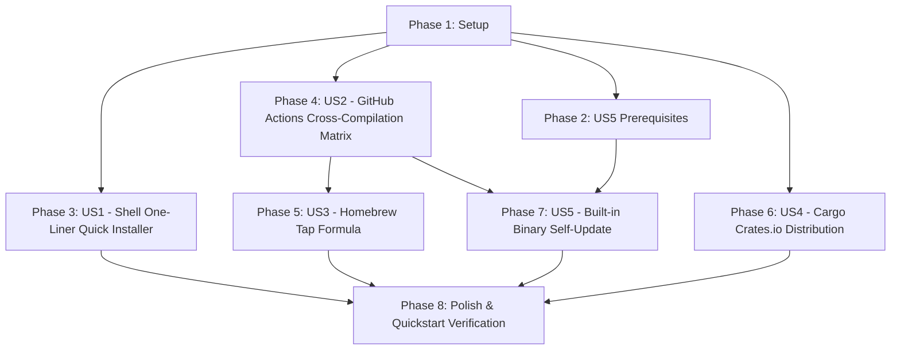

# Tasks: RTK-Aligned Distribution and Installation Channels

**Input**: Design documents from `/specs/002-distribution-installation/`

**Prerequisites**: `plan.md`, `spec.md`, `data-model.md`, `contracts/`, `research.md`, `quickstart.md`

**Organization**: Tasks are grouped by user story to enable independent implementation and testing of each story.

## Task Format: `[ID] [P?] [Story?] Description with file path`

- **[P]**: Parallelizable (different files, no dependencies)
- **[Story]**: User story label (e.g. `[US1]`, `[US2]`, `[US3]`, `[US4]`, `[US5]`)

---

## Dependency Graph & Story Execution Order



Note: US1 (shell installer) fetches from GitHub Releases for full integration but can be tested independently with local binaries or a mock release. US3 and US5 require US2 (release artifacts) for end-to-end verification.

---

## Phase 1: Setup (Shared Infrastructure)

**Purpose**: Distribution infrastructure, release profile optimization, and directory setup.

- [X] T001 Initialize distribution files and directory placeholders in `install.sh` and `Formula/rgt.rb`
- [X] T002 Configure release profile optimizations (`lto = true`, `codegen-units = 1`, `panic = "abort"`, `strip = true`) in `Cargo.toml`

---

## Phase 2: US5 Prerequisites (Platform & Checksum Helpers)

**Purpose**: Rust-side platform detection and SHA-256 verification helpers needed by the self-updater (US5). These are NOT required for US1-US4; only US5 is blocked by this phase.

- [X] T003 [P] Implement platform detection helper (OS, CPU architecture, target triple mapping) in `src/updater/platform.rs`
- [X] T004 [P] Implement SHA-256 manifest parser and verification helper in `src/updater/checksum.rs`

**Checkpoint**: US5 helpers ready. US1-US4 can proceed independently in parallel.

---

## Phase 3: User Story 1 - Shell One-Liner Quick Installer (`curl | sh`) (Priority: P1) 🎯 MVP

**Goal**: POSIX shell installer script (`install.sh`) auto-detects OS/arch, fetches release asset, verifies SHA-256, installs binary to `~/.local/bin`, and validates PATH.

**Independent Test**: Execute `./install.sh --bin-dir ./test-bin`, verify `test-bin/rgt --version` executes cleanly in under 10 seconds (SC-001).

- [X] T005 [P] [US1] Integration test for POSIX shell installer script (OS/arch detection, download, checksum, install, PATH validation, timing <10s per SC-001) in `tests/integration/test_installer_script.rs`
- [X] T006 [US1] Implement OS and CPU architecture auto-detection (`uname -s` → `darwin`/`linux`, `uname -m` → `x86_64`/`aarch64`) in `install.sh`
- [X] T007 [US1] Implement GitHub release asset fetching, SHA-256 checksum verification (`shasum -a 256`/`sha256sum`), archive extraction (`.tar.gz`/`.zip`), and corrupted-asset abort in `install.sh`
- [X] T008 [US1] Implement `~/.local/bin` installation directory logic with `--bin-dir` override, `--system` flag for `/usr/local/bin` (sudo fallback), PATH validation, and shell configuration instructions (`.zshrc`, `.bashrc`, `~/.config/fish/config.fish`) in `install.sh`

**Checkpoint**: Shell one-liner installer functional and independently testable. MVP scope reached.

---

## Phase 4: User Story 2 - Automated GitHub Actions Cross-Compilation Matrix (Priority: P1)

**Goal**: Release workflow (`.github/workflows/release.yml`) cross-compiles stripped single binaries (<15MB) for 5 target platform triples upon tag push (`v*`).

**Independent Test**: Push tag `v0.1.0`, verify all 5 platform archives + `checksums.txt` are attached to the GitHub Release, and cross-compilation completes in under 15 minutes (SC-003).

- [X] T009 [P] [US2] Implement continuous integration build and test matrix in `.github/workflows/ci.yml`
- [X] T010 [US2] Implement cross-compilation release workflow matrix for 5 target triples (`x86_64-apple-darwin`, `aarch64-apple-darwin`, `x86_64-unknown-linux-gnu`, `aarch64-unknown-linux-gnu`, `x86_64-pc-windows-msvc`) with stripped single-binary assets (<15MB) in `.github/workflows/release.yml`
- [X] T011 [US2] Implement SHA-256 `checksums.txt` generation (one line per archive, `shasum -a 256` compatible) and GitHub Release asset upload step in `.github/workflows/release.yml`

**Checkpoint**: Automated cross-compilation release pipeline configured.

---

## Phase 5: User Story 3 - Homebrew Tap Formula (Priority: P1)

**Goal**: Maintain `Formula/rgt.rb` supporting Homebrew tap installation (`brew install rafael-bianchi/tap/rgt`) with dual MIT OR Apache-2.0 license.

**Independent Test**: Run `brew audit --strict Formula/rgt.rb` and `brew install --build-from-source Formula/rgt.rb`, verifying no macOS Gatekeeper/notarization blocking (SC-004).

- [X] T012 [P] [US3] Implement Homebrew formula definition template (`license "MIT OR Apache-2.0"`) supporting macOS Intel (x86_64), Apple Silicon (arm64), and Linux (x86_64, aarch64) in `Formula/rgt.rb`
- [X] T013 [US3] Implement automated Homebrew formula version bump, URL, and SHA-256 update step triggered by release workflow in `.github/workflows/release.yml`

**Checkpoint**: Homebrew tap formula ready.

---

## Phase 6: User Story 4 - Cargo Crates.io & `cargo install` Distribution (Priority: P1)

**Goal**: Configure package metadata for crates.io publishing with bundled SQLite (`rusqlite` feature `bundled` already in `Cargo.toml`).

**Independent Test**: Run `cargo package` (verify clean output, no unneeded files) and `cargo install --path .`.

- [X] T014 [P] [US4] Configure crate publishing metadata (keywords: `graph`, `cli`, `dependency`, `tracking`; categories: `command-line-utilities`, `development-tools`; `documentation`, `repository` URLs) in `Cargo.toml`
- [X] T015 [US4] Verify clean `cargo package` output, exclude unneeded files via `exclude`/`include` in `Cargo.toml`, and test `cargo install --path .`

---

## Phase 7: User Story 5 - Built-in Binary Self-Update Command (`rgt update`) (Priority: P2)

**Goal**: `rgt update` checks GitHub Releases API, verifies SHA-256 hash, and atomically replaces active executable in under 5 seconds (SC-005). Supports `--check`, `--yes`, and `--version` flags.

**Independent Test**: Run `rgt update --check` and `rgt update --yes` against a test release, verifying update completes in under 5 seconds.

- [X] T016 [P] [US5] Contract test for GitHub release API parser and update checking (mock HTTP responses, `--check`, `--yes` flag paths) in `tests/contract/test_update_contract.rs`
- [X] T017 [US5] Implement GitHub REST API client for fetching latest release (`/repos/rafael-bianchi/rgt/releases/latest`), asset discovery by target triple, and graceful handling of API rate limits (429 retry with backoff) in `src/updater/github.rs`
- [X] T018 [US5] Implement atomic binary replacement (tempfile + `chmod 0755` + `std::fs::rename` on Unix; rename old to `.old`, write new, schedule cleanup on Windows) in `src/updater/atomic.rs`
- [X] T019 [US5] Implement `rgt update` CLI subcommand (`clap`) with `--check` (report availability, exit 0/1), `--yes` (skip confirmation prompt), and `--version <tag>` (target specific release) in `src/cli/update.rs` and register in `src/cli/mod.rs` and `src/main.rs`

---

## Phase 8: Polish & Cross-Cutting Concerns

**Purpose**: Documentation, end-to-end validation, and performance acceptance.

- [X] T020 [P] Update `README.md` with multi-channel installation instructions (`curl -fsSL ... | sh`, Homebrew, `cargo install`, `rgt update`) in `README.md`
- [X] T021 [P] End-to-end quickstart scenario validation executing all `quickstart.md` steps in `tests/integration/test_distribution_quickstart.rs`
- [X] T022 [P] Performance acceptance test verifying SC-001 (<10s shell install) and SC-005 (<5s binary update) in `tests/integration/test_distribution_performance.rs`

---

## Parallel Execution Opportunities

```text
# Phase 1 (Setup): Independent tasks
T001: install.sh and Formula/rgt.rb placeholders
T002: Cargo.toml release profile

# Phase 2 (US5 Prerequisites): Parallel
T003: Platform detection in src/updater/platform.rs
T004: SHA-256 parser in src/updater/checksum.rs

# Phase 4 (US2): T009 (ci.yml) is independent of T010/T011
# Phase 5 (US3): T012 (formula) is independent of T013 (automation step, needs T011)
# Phase 6 (US4): T014 (metadata) can precede T015 (verification)
# Phase 7 (US5): T016 (contract test) is independent of T017-T019
# Phase 8 (Polish): T020, T021, T022 are all independent [P]

# Once Phase 1 completes, US1, US2, US4, and Phase 2 can all proceed in parallel.
# US3 waits on US2 (needs release artifacts).
# US5 waits on US2 + Phase 2.
```

---

## Implementation Strategy

### MVP Scope (User Story 1 Only)
1. Phase 1 (Setup)
2. Phase 3 (User Story 1 - Shell One-Liner Quick Installer)
3. Validate independent test criteria for US1 (`install.sh --bin-dir ./test-bin` → `test-bin/rgt --version` in <10s).

### Full Incremental Delivery
- Add US2 (GitHub Actions Cross-Compilation Matrix) → Binary Release Automation
- Add US3 (Homebrew Tap Formula) → macOS/Linux Package Manager
- Add US4 (Crates.io Package) → Rust Ecosystem Integration
- Add US5 (Binary Self-Update) + Phase 2 (Prerequisites) → Command-Line `rgt update`
- Phase 8 (Polish) → Documentation + E2E + Performance Validation
