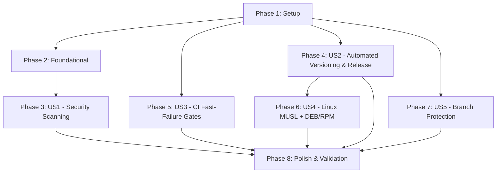

# Tasks: CI/CD Pipeline Security & Delivery Hardening

**Input**: Design documents from `/specs/003-devops-enhancement/`

**Prerequisites**: `plan.md`, `spec.md`, `data-model.md`, `contracts/`, `research.md`, `quickstart.md`

**Organization**: Tasks are grouped by user story to enable independent implementation and testing of each story.

## Task Format: `[ID] [P?] [Story?] Description with file path`

- **[P]**: Parallelizable (different files, no dependencies)
- **[Story]**: User story label (e.g. `[US1]`, `[US2]`, `[US3]`, `[US4]`, `[US5]`)

---

## Dependency Graph & Story Execution Order



Note: US3 and US5 are fully independent. US1 depends on Phase 2 (needs ci.yml baseline restructure). US2 depends on release.yml baseline. US4 extends US2's release pipeline with new targets and packages.

---

## Phase 1: Setup (Shared Infrastructure)

**Purpose**: Package metadata and tooling prerequisites.

- [X] T001 Configure DEB package metadata (`[package.metadata.deb]` with maintainer, section, assets, depends) in `Cargo.toml`
- [X] T002 [P] Configure RPM package metadata (`[package.metadata.generate-rpm]` with license, summary, assets) in `Cargo.toml`

---

## Phase 2: Foundational (CI Baseline Restructure)

**Purpose**: Restructure the existing CI workflow into the dependency chain that all user story phases extend.

**⚠️ CRITICAL**: US1, US3, and US4 depend on the CI/release workflows having the correct structure first.

- [X] T003 Restructure `ci.yml` to dependency chain `fmt → clippy → (test | security)` using job `needs` in `.github/workflows/ci.yml`
- [X] T004 Refactor `release.yml` to use `workflow_call` (reusable by both `cd.yml` and `workflow_dispatch`) with `tag` and `prerelease` inputs in `.github/workflows/release.yml`
- [X] T005 [P] Add `Swatinem/rust-cache@v2` to all Rust build jobs in `.github/workflows/ci.yml` and `.github/workflows/release.yml`

**Checkpoint**: Foundation ready — user story implementation can now begin in parallel.

---

## Phase 3: User Story 1 - Automated Vulnerability & Risk Scanning (Priority: P1) 🎯 MVP

**Goal**: Every PR is automatically scanned for dependency CVEs, dangerous code patterns, new dependency additions, and security-critical file changes. CRITICAL/HIGH findings block merge.

**Independent Test**: Open a PR adding a dependency with a known CVE; verify the `security` job fails.

- [X] T006 [P] [US1] Add `cargo-audit` CVE check to `security` job (fail on HIGH/CRITICAL, warn on database unreachable) in `.github/workflows/ci.yml`
- [X] T007 [US1] Add dangerous code pattern scanner (grep-based: `Command::new`, `unsafe`, `TcpStream`, `UdpSocket`, `.unwrap()`, `panic!`, `expect(`) to `security` job in `.github/workflows/ci.yml`
- [X] T008 [US1] Add new dependency detection (parse `Cargo.toml` diff for `+` lines) and supply-chain audit warning to `security` job in `.github/workflows/ci.yml`
- [X] T009 [US1] Add security-critical file detection (git diff against base) and two-maintainer review escalation warning to `security` job in `.github/workflows/ci.yml`
- [X] T010 [US1] Add Clippy security lints (`-W clippy::unwrap_used -W clippy::panic -W clippy::expect_used`) to `security` job in `.github/workflows/ci.yml`

**Checkpoint**: PR security scanning functional. A PR with a known CVE, dangerous pattern, or new untrusted dependency will fail CI.

---

## Phase 4: User Story 2 - Automated Versioning & Orchestrated Release Delivery (Priority: P1)

**Goal**: Releases are auto-versioned from conventional commits via `release-please`. Pre-releases from `develop` and stable releases from `main` use the identical reusable `release.yml` pipeline.

**Independent Test**: Merge a `feat:` commit to `main`; verify CI bumps minor version, creates tag, builds all platforms, and publishes release.

- [X] T011 [US2] Implement `cd.yml` with `release-please-action@v4` (release-type: rust) on push to `main` branch in `.github/workflows/cd.yml`
- [X] T012 [US2] Implement pre-release computation job in `cd.yml` for push to `develop` branch: analyze conventional commits, compute `dev-{X}.{Y}.{Z}-rc.{run}` tag (default to v0.1.0 if no prior stable tag exists) in `.github/workflows/cd.yml`
- [X] T013 [US2] Wire `cd.yml` to call `release.yml` (reusable `workflow_call`) for both develop pre-releases and main stable releases in `.github/workflows/cd.yml`
- [X] T014 [US2] Add floating `latest` tag update step to `cd.yml` (force-push `latest` tag to newest stable release) in `.github/workflows/cd.yml`
- [X] T015 [P] [US2] Add manual release override capability via `workflow_dispatch` on `release.yml` accepting `tag` and `prerelease` inputs in `.github/workflows/release.yml`

**Checkpoint**: Automated CD pipeline configured. Pushing to `develop` creates pre-release; merging to `main` creates stable release.

---

## Phase 5: User Story 3 - Optimized CI Pipeline with Fast-Failure Gates (Priority: P2)

**Goal**: Format and lint fails fast (within 30-60s), skipping the expensive test matrix. Parallel test and security jobs run only after clippy passes.

**Independent Test**: Submit a PR with a formatting error; verify CI fails in <30s and the test matrix never starts.

- [X] T016 [US3] Add `timeout-minutes` limits to CI jobs: fmt (1), clippy (3), test (20), security (10) in `.github/workflows/ci.yml`
- [X] T017 [P] [US3] Add `check-test-presence` job (verify new/changed Rust modules have corresponding tests, run only on develop PRs) in `.github/workflows/ci.yml`

**Checkpoint**: CI pipeline respect dependency order and timeouts. Fast failures skip expensive jobs.

---

## Phase 6: User Story 4 - Universal Linux Installation Support (Priority: P2)

**Goal**: Release pipeline produces a statically-linked Linux MUSL binary, a DEB package, and an RPM package alongside existing platform archives.

**Independent Test**: Pull the MUSL binary from a release and run it in Alpine and Ubuntu Docker containers. Install DEB on Ubuntu, RPM on Fedora.

- [X] T018 [US4] Add `x86_64-unknown-linux-musl` target to release build matrix (replace `x86_64-unknown-linux-gnu` for Linux x86_64) with `musl-tools` installation step in `.github/workflows/release.yml`
- [X] T019 [US4] Add DEB package build job using `cargo-deb` to release pipeline, upload as release artifact in `.github/workflows/release.yml`
- [X] T020 [US4] Add RPM package build job using `cargo-generate-rpm` to release pipeline (Fedora container), upload as release artifact in `.github/workflows/release.yml`
- [X] T021 [US4] Update `install.sh` Linux x86_64 target triple from `x86_64-unknown-linux-gnu` to `x86_64-unknown-linux-musl` in `install.sh` and `src/updater/platform.rs`

**Checkpoint**: MUSL binary + DEB + RPM packages produced on each release. Installer references MUSL target.

---

## Phase 7: User Story 5 - Branch Protection Enforcement (Priority: P3)

**Goal**: PRs targeting `main` from non-`develop` branches are automatically labeled and receive instructions to retarget `develop`.

**Independent Test**: Open a PR from a feature branch targeting `main`; verify CI labels it `wrong-base` and posts a comment.

- [X] T022 [US5] Implement `pr-target-check.yml` workflow using `pull_request_target` trigger to detect and flag direct-to-main PRs from non-develop branches in `.github/workflows/pr-target-check.yml`

---

## Phase 8: Polish & Cross-Cutting Concerns

**Purpose**: Documentation, install script update, and quickstart validation.

- [X] T023 Update `install.sh` to support `rgt_{version}_amd64.deb` and `rgt.x86_64.rpm` package naming in the release asset discovery logic in `install.sh` (sequences after T021 to avoid file conflict)
- [X] T024 [P] Update `Formula/rgt.rb` Linux x86_64 URL to reference `x86_64-unknown-linux-musl` target in `Formula/rgt.rb`
- [X] T025 [P] Run quickstart validation scenarios 1-6 from `quickstart.md`, documenting results in `specs/003-devops-enhancement/quickstart.md`

---

## Parallel Execution Opportunities

```text
# Phase 1 (Setup): Parallel
T001: Cargo.toml [package.metadata.deb]
T002: Cargo.toml [package.metadata.generate-rpm]

# Phase 4 (US2): T015 (workflow_dispatch on release.yml) is parallel with T011-T014
# Phase 5 (US3): T016 and T017 are independent [P]

# After Phase 2 completes, US1, US3, US5 can proceed in parallel
# After Phase 4 completes, US4 can proceed
# Phase 8 (Polish): T023 sequences after T021 (same file); T024 and T025 are independent [P]
```

---

## Implementation Strategy

### MVP Scope (User Story 1 Only)
1. Phase 1 (Setup) + Phase 2 (Foundational)
2. Phase 3 (US1 - Security Scanning)
3. Validate: Open a PR with a known-vulnerable dependency, verify security job fails.

### Incremental Delivery
- US1 (Security Scanning) → PR safety net
- US2 (Automated Releases) → No more manual version tags
- US3 (Fast CI) → Faster contributor feedback
- US4 (Linux packages) → Broader Linux adoption
- US5 (Branch protection) → Workflow guardrails
- Phase 8 (Polish) → Documentation and validation
